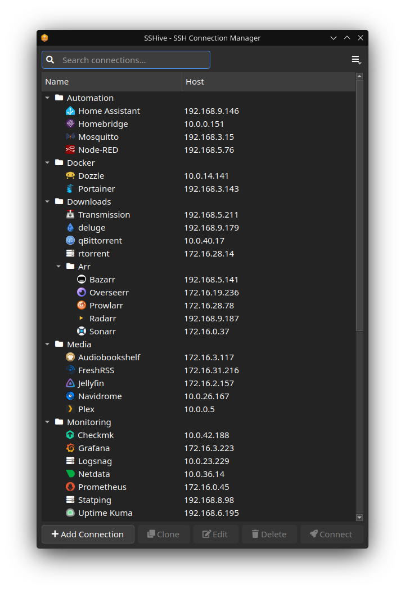
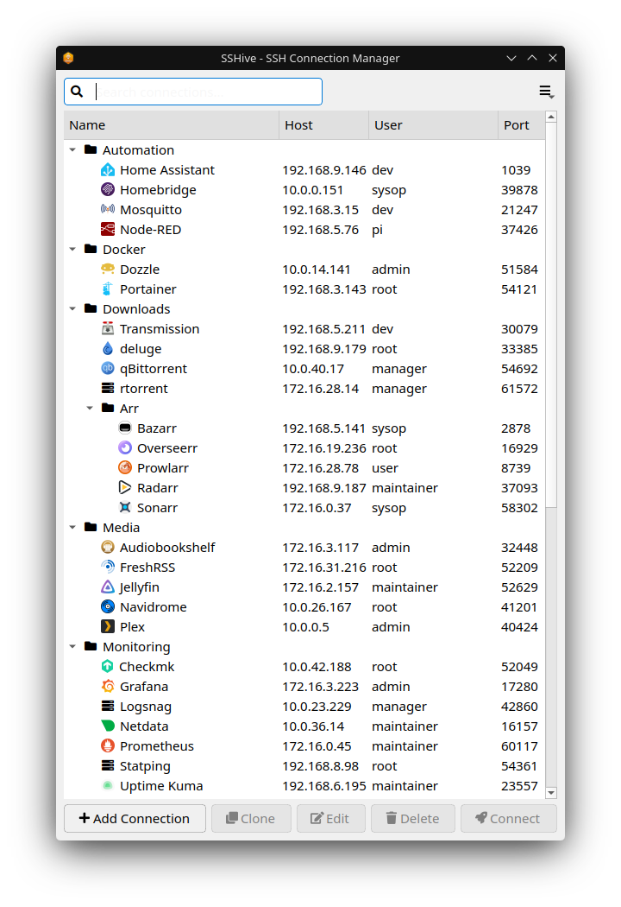

# SSHive 🐝

[](https://github.com/SavageCore/sshive/actions/workflows/lint.yml)
[](https://github.com/SavageCore/sshive/actions/workflows/test.yml)
[](https://codecov.io/gh/SavageCore/sshive)
[](https://github.com/SavageCore/sshive/releases)
[](https://opensource.org/licenses/MIT)

**Your hive of SSH connections** - A modern, cross-platform SSH connection manager built with PySide6.

Organize your SSH connections into hierarchical groups, connect with a single click, and never memorize `ssh -i ~/.ssh/key.pem user@host -p 2222` again.

## Features

- 🗂️ **Hierarchical Groups:** Organize your connections into folders and subfolders.
- 🚀 **One-Click Connect:** Double-click any server to instantly launch your system's native terminal emulator.
- 🔑 **Advanced Authentication:** Native support for SSH Keys (OpenSSH), PuTTY Private Keys (.ppk), and standard password authentication.
- 🔒 **Background Validation:** Validates your credentials in the background before launching the terminal window, preventing sudden window closures.
- 🥸 **Incognito Mode:** Press `Ctrl+I` to instantly obfuscate your entire server list with heavily randomized fake data (great for streaming or presenting).
- 🎨 **Dynamic Icons:** Search and auto-assign self-hosted service icons (powered by selfh.st).
- 🌓 **Native Theming:** Automatically adapts to your system's dark or light theme using native Fusion styling.
- 🔄 **Auto-Updates:** Cross-platform update detection ensures you're always running the latest version.
- 💾 **Portable Storage:** Connections are saved in a simple, portable JSON file (`~/.config/sshive/connections.json`).




## Installation

SSHive is designed to be easily installable across multiple Linux environments, as well as Windows and macOS.

**Choose your Operating System:**  
[🐧 Linux](#linux) | [🪟 Windows](#windows) | [🍏 macOS](#macos) | [💻 Source (Any OS)](#install-from-source-any-os)

### Linux

#### Native Linux Packages (Recommended)

The best way to install SSHive on Linux is using our native packages, which integrate perfectly with your system.

1. Download the latest `.deb` (Debian/Ubuntu) or `.rpm` (Fedora/RHEL) from the [Releases page](https://github.com/SavageCore/sshive/releases).
2. Install via your package manager:
   ```bash
   # Debian/Ubuntu
   sudo apt install ./SSHive_*.deb
   # Fedora/RHEL
   sudo dnf install ./SSHive-*.rpm
   ```
3. For **Arch Linux**, clone the repository and build using the provided `PKGBUILD`: `makepkg -si`.

### Flatpak

SSHive is also available as a Flatpak, ideal for immutable distributions or sandboxed environments.

1. Download the latest `.flatpak` bundle from the [Releases page](https://github.com/SavageCore/sshive/releases).
2. Install it locally:
   ```bash
   flatpak install --user SSHive.flatpak
   ```

### AppImage

If you prefer a single portable executable, you can use the AppImage.

1. Download the latest `.AppImage` from the [Releases page](https://github.com/SavageCore/sshive/releases).
2. Make it executable:
   ```bash
   chmod +x SSHive-x86_64.AppImage
   ```
3. Run it, or double-click the file in your file manager.

### Windows

1. Download the latest `.exe` installer or standalone executable from the [Releases page](https://github.com/SavageCore/sshive/releases).
2. Run the executable.
3. _Note: Ensure you have `ssh` (usually built-in) and [PuTTY](https://www.chiark.greenend.org.uk/~sgtatham/putty/) installed if you plan to use password authentication._

### macOS

1. Download the latest `.dmg` or `.app` from the [Releases page](https://github.com/SavageCore/sshive/releases).
2. Drag SSHive to your Applications folder.
3. _Note: You may need to run `brew install sshpass` if you plan to use password authentication._

### Install from Source (Any OS)

SSHive is built using `uv`, which makes source installation incredibly fast and reliable. Note: Python 3.10+ is required.

```bash
# Clone the repository
git clone https://github.com/SavageCore/sshive.git
cd sshive

# Run directly without installing (uv handles the isolated environment)
uv run sshive
```

## Usage & Configuration

### Adding a Connection

1. Click **"➕ Add Connection"**
2. Fill in the connection details: Name, Host, User, and Port.
3. Choose your Auth Method:
   - **SSH Key:** Browse for your `id_rsa`, `id_ed25519`, or `.ppk` file.
   - **Password:** SSHive will securely pass your password to the SSH client (requires `sshpass` on Linux/macOS or `putty` on Windows).
4. Organize by typing a **Group** name (e.g., `Work/Production`).
5. (Optional) Enter a service name (like `proxmox` or `portainer`) for a custom icon automatically fetched from [selfh.st/icons](https://selfh.st/icons/).

### Keyboard Shortcuts

- `Ctrl+I` - Toggle Incognito Mode (obfuscates server list)
- `Enter` - Connect to selected server (Or double-click)
- `Delete` - Delete selected connection
- `Ctrl+N` - New connection

## Requirements & Dependencies

SSHive relies on your system's utilities to actually perform the SSH connection.

- **Linux & macOS:**
  - Requires `ssh` (OpenSSH client, usually pre-installed).
  - For **Password Auth**, `sshpass` must be installed.
  - For **.ppk Key Auth**, `puttygen` (from the `putty-tools` package) must be installed to convert the keys dynamically.
  - **Supported Terminals:** konsole, gnome-terminal, alacritty, kitty, xterm, tilix, terminator, iTerm2, Terminal.app.
- **Windows:**
  - Requires `ssh` (usually pre-installed with Windows 10/11).
  - For **Password Auth** or **.ppk Key Auth**, [PuTTY](https://www.chiark.greenend.org.uk/~sgtatham/putty/) (`plink.exe`) or [KiTTY](http://www.9bis.net/kitty/) (`klink.exe`) must be installed and added to your system `PATH`.
  - **Supported Terminals:** Windows Terminal (`wt.exe`), PuTTY (`putty.exe`), KiTTY (`kitty.exe`).

## Development

We welcome contributions! The project uses `uv` for lightning-fast dependency management, `ruff` for linting, and `pytest` for testing.

```bash
# Setup the project
git clone https://github.com/SavageCore/sshive.git
cd sshive
uv sync

# Run the app locally
make run

# Run the test suite
make test

# Format and lint code
make fix
```

### Building Packages

You can also build the application formats locally by executing these Makefile targets from the project directory:

```bash
# Build the flatpak (Requires flatpak-builder installed)
make flatpak

# Build an AppImage locally
make appimage

# Build a .deb or .rpm package (Requires nfpm installed)
make deb
make rpm
```

## License

MIT License - see [LICENSE](LICENSE) file for details.

---

Made with 🐝 for SSH enthusiasts everywhere.
