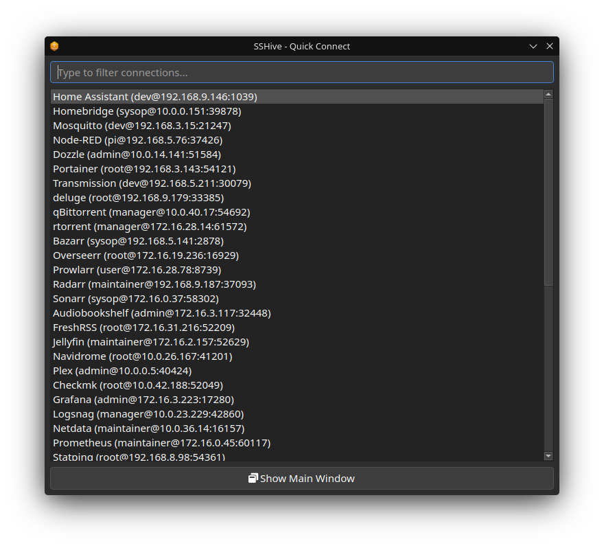
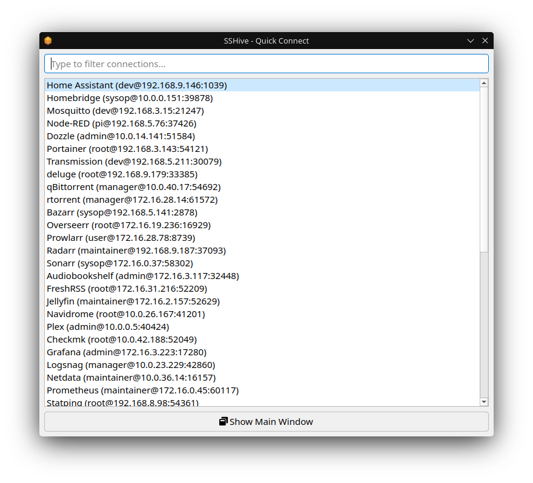
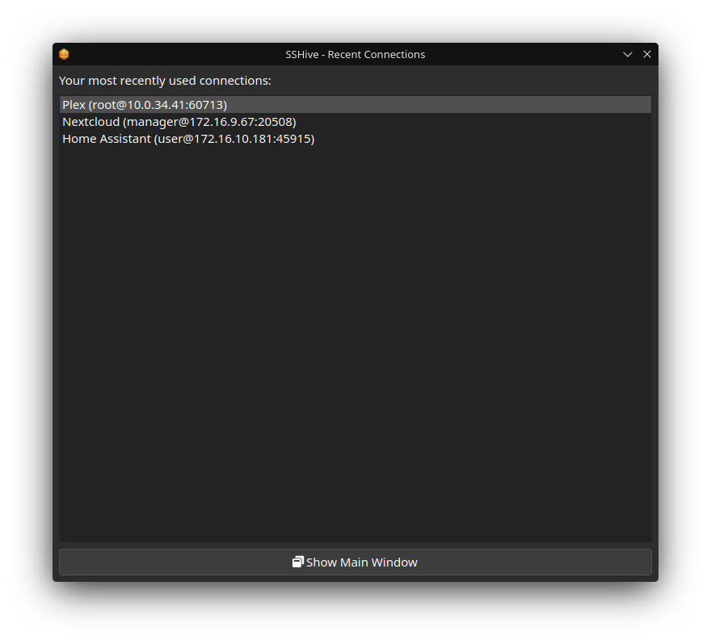
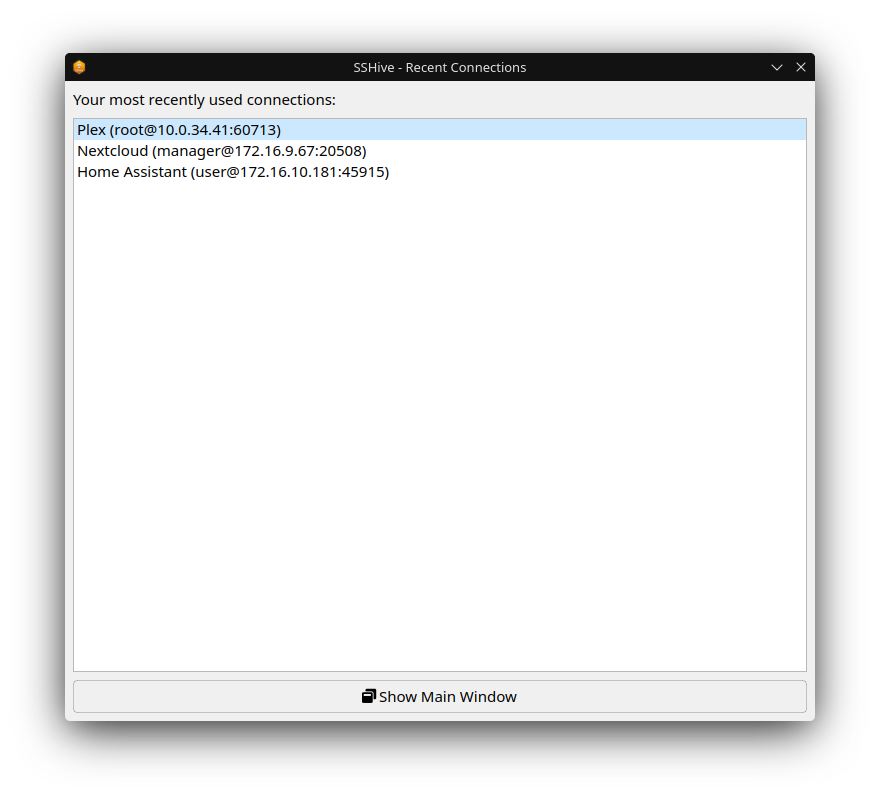
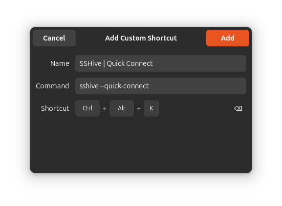
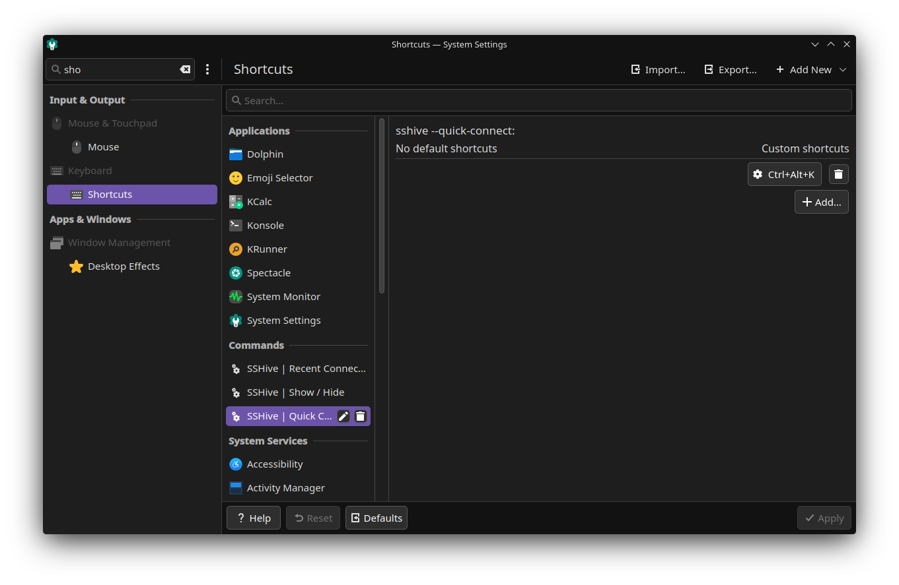

# Global Keyboard Shortcuts

SSHive can be triggered from anywhere on your system using desktop keyboard shortcuts. This guide explains how to set up global shortcuts through your desktop environment's GUI.

## Overview

SSHive supports three quick-access modes:

- `sshive --show` – Show/focus the main window (toggle if already visible)
- `sshive --quick-connect` – Open a quick connection search popup
- `sshive --recent` – Show the recent connections menu

These work best when SSHive is already running in the background (e.g., in the system tray).

### Quick Connect Preview

The `--quick-connect` command opens a fast search popup that lets you filter and launch connections instantly:

### Recent Connections Preview

The `--recent` command displays your most recently used connections in a similar popup interface:

## GNOME

1. Open **Settings → Keyboard → View and Customize Shortcuts → Custom Shortcuts**
2. Click **Add Shortcut...**
3. For each of the three actions below, create a new shortcut:

| Action | Command | Suggested Shortcut |
|--------|---------|-------------------|
| Show/Hide | `sshive --show` | `Ctrl+Alt+S` |
| Quick Connect | `sshive --quick-connect` | `Ctrl+Alt+K` |
| Recent Connections | `sshive --recent` | `Ctrl+Alt+R` |

**Steps for each shortcut:**
- Enter the name (e.g., "SSHive | Quick Connect")
- Paste the command from the table
- Click the shortcut field and press your desired key combination
- Click Add

## KDE Plasma

1. Open **System Settings → Keyboard → Shortcuts**
2. Click **Add New → Command or Script...**
3. For each of the three actions below, create a new shortcut:

| Action | Command | Suggested Shortcut |
|--------|---------|-------------------|
| Show/Hide | `sshive --show` | `Ctrl+Alt+S` |
| Quick Connect | `sshive --quick-connect` | `Ctrl+Alt+K` |
| Recent Connections | `sshive --recent` | `Ctrl+Alt+R` |

**Steps for each shortcut:**
- Enter the name (e.g., "SSHive | Quick Connect")
- Paste the command from the table
- Select the new command in the left panel
- Click `Add...` and then `Input ...` to record your keybind
- Click Apply

## Notes

- **Auto-launch:** Shortcuts will automatically launch SSHive if it's not running. For the fastest response, keep SSHive running in the system tray (enable system tray integration and close the window).
- **Troubleshooting**: If shortcuts don't work:
  - Ensure the `sshive` command is in your PATH (`which sshive`)
  - Check for shortcut conflicts with other applications
  - Verify the command executes correctly in a terminal first
- **Other desktops**: Additional desktop environments (Sway, i3, XFCE, etc.) may have their own shortcut configuration methods. Refer to your desktop's documentation.
